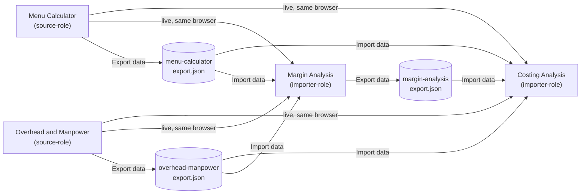

# Costing Analysis — change notes

(Covers `interactive-costing-analysis.html` / `.js` — this session's own
tool. Kept as a separate file from `MARGIN_AUDIT_CHANGE_NOTES.md`, which
the parallel session on Margin Analysis maintains — the two sides
coordinate through the shared standard docs (`EXPORT_IMPORT_FORMAT.md`,
`COST_BUFFER_STANDARD.md`, `PANEL_TOGGLE_STANDARD.md`,
`CROSS_TOOL_IMPORT_STANDARD.md`), not by editing each other's code or
changelog directly.)

## 2026-09-19 — Brought into full compliance with CROSS_TOOL_IMPORT_STANDARD.md (written by the Margin Analysis session, 2026-09-18)

**What prompted this.** `CROSS_TOOL_IMPORT_STANDARD.md` arrived naming
this page's own `importDataFile()` as the reference implementation
everyone else was modeled on. Checked it against the standard's own
5-step retrofit checklist anyway, since "reference implementation"
isn't the same as "audited" — and it turned up two real gaps, plus one
separate bug the standard doesn't mention but its own stated goal
("importing a file and having the other tool open in another tab
produce identical results, one code path either way") implies should
never happen.

**Gap 1 — helper text was missing entirely.** The standard requires
helper text next to an importer's button naming every accepted shape,
in plain language, updated in the same commit the accepted set
changes. Costing Analysis's "Import data" button had no helper text at
all — Margin Analysis's own version at least had some, just briefly
stale. Fixed with a `.tooltip-icon` next to the button — the same spot
Margin Analysis's own "Export data" button already uses one — naming
all three accepted shapes.

**Gap 2 — the doc-comment above `importDataFile()` was stale.** It said
a Margin Analysis export was "not yet" handled; the code three lines
below it already handled it. Rewritten to describe all three shapes
correctly and to point at `CROSS_TOOL_IMPORT_STANDARD.md`, per that
doc's own checklist step 5.

**Real bug, previously invisible — `costBufferPct` silently dropped on
the file-import path.** Menu Calculator's live broadcast has carried
`costBufferPct` since 2026-09-16 (`COST_BUFFER_STANDARD.md`), and its
`.json` export carries it too (`EXPORT_IMPORT_FORMAT.md`) — but
`importDataFile()` never forwarded it into the `handleSyncPayload()`
call, only the live-sync path did. So a dish synced live and the
*same* dish imported from a file could disagree on this one field,
quietly — exactly what the "one code path either way" design is
supposed to prevent. Fixed: `costBufferPct` now threads through
identically on both paths.

**Small feature riding on that fix.** Now that the field actually
reaches this page, added the same touch Margin Analysis added on its
own side (see its 2026-09-17 entry): the "synced" badge next to
Ingredients & packaging now reads "← Menu Portion Creator (Dish Name,
incl. 10% cost buffer)" whenever the source dish had its buffer on —
via live sync or an imported file, identically. Purely informational,
same as Margin Analysis's version — nothing in the break-even math
reads it.

**Small unrelated fix, found while diffing this page against its
siblings for this round:** `styles.css?v=18` → `?v=19`.
`menu-calculator.html` and `margin-audit-calculator.html` were both
already on `v=19` (current since the 2026-09-16 Cost Buffer CSS
additions); this page alone was a version behind — meaning a browser
that had cached this page from before that date could still be serving
stale, pre-Cost-Buffer CSS to it specifically.

**Also hardened:** every branch of `importDataFile()`'s dispatcher now
guards with `data &&` before reading `data.rzExportType`, matching
Margin Analysis's own dispatcher. A file containing literal JSON
`null` (valid JSON — parses fine) used to throw, uncaught, inside the
`FileReader.onload` handler past that point; it now falls through
cleanly to the "Unrecognised file" alert instead.

**Version bumps:** script build tag
`2026-09-16-panel-toggle-standard` → `2026-09-19-cross-tool-import-parity`;
`interactive-costing-analysis.js?v=15` → `?v=16`.

### The cross-tool picture, as it stands today

Both arrows into any importer (live or file) now converge on that
importer's own `handleSyncPayload()` for the Menu Calculator and
Overhead & Manpower shapes. The one exception is Margin Analysis's own
export arriving at Costing Analysis — it has no live-sync equivalent
to converge with, so that branch populates `importedQuadrants`
directly instead.

### What this deliberately did NOT touch

- Menu Calculator's or Overhead & Manpower's own export code — both
  already produce the right shape, and per the standard, source-role
  tools don't get an import feature of their own.
- A Costing-Analysis-side export — nothing downstream wants to import
  a break-even analysis today, so this page stays importer-only.
  Revisit only if that changes.
- No new user-configurable value was introduced this round, so there's
  nothing new for a settings sheet this time — this was a
  consistency/parity pass, not a new feature with its own rate or
  default.

### Jargon index (terms specific to this round)

| Term | Plain-English meaning |
|---|---|
| Source-role tool | Only ever produces data for others to read (Menu Calculator, Overhead & Manpower) — no import feature of its own. |
| Importer-role tool | Reads data from siblings (Costing Analysis, Margin Analysis) — owns an `importDataFile()`. |
| `rzExportType` | The field inside every exported `.json` that says which tool produced it — how an importer knows what it's looking at. |
| `costBufferPct` | The % of Menu Calculator's dish-level Cost Buffer actually applied — informational only; the cost figure it rides alongside (`costPerPortion`) is already the true, buffered number either way. |
| `handleSyncPayload()` | The one function, per tool, that actually applies an incoming number — shared by the live path and the file-import path so the two can't quietly drift apart. |
| Live sync vs. file import | Two delivery mechanisms for the same data: live (another tool open in a browser tab right now) or a saved `.json` (a different day/device/person). |

### Testing done, given I can't render a browser here

`node --check` on the full JS file (clean). Every `getElementById`/
`querySelector` this round's edits touch, cross-checked against the
HTML — no new ids introduced, only existing ones read. Traced
`costBufferPct` by hand through both paths: (a) a Menu Calculator block
with the buffer on → live broadcast → `handleSyncPayload` →
`syncedMenuItems` → `applySyncedMenuItem` → badge includes the note;
(b) the same block → `exportMenuData()` → saved file →
`importDataFile()` → same `handleSyncPayload` call → same badge text.
Both now produce identical output for the same source dish.

**Worth testing directly, since I can't run a browser here:** export a
dish from Menu Calculator with Cost Buffer on, import that file into
Costing Analysis, and confirm the "incl. N% cost buffer" note shows
next to Ingredients & packaging — then do the same with Menu
Calculator open live in a second tab instead of a file, and confirm
the note reads identically either way.

## KIV / open items

- **A genuinely separate, non-code settings sheet** (change a value
  without opening any `.js` file) doesn't exist anywhere on this site
  yet — every tool's defaults are still plain JS constants with a
  markdown table alongside documenting *where* to change them in the
  code, not a true externally-editable source. Flagging this against
  your own stated preference for one — not something this round
  solved. A real fix (e.g. one `site-config.json` every tool
  `fetch()`s at load, still no build step) is a scoped, separate piece
  of work if you want it built next — happy to spec it out.
- Everything already flagged as open in `CROSS_TOOL_IMPORT_STANDARD.md`
  (Printing Calculator, Food Worth, Rental Calculator not yet
  retrofitted) is unchanged by this round.

## Deploy checklist

- [ ] Replace `interactive-costing-analysis.js` and
      `interactive-costing-analysis.html` with the two files delivered
      alongside this note — both full-file replacements, not patches.
- [ ] Also replace your copy of `CROSS_TOOL_IMPORT_STANDARD.md` with
      the updated one delivered alongside this note (or hand it to the
      Margin Analysis session — it's the doc it wrote), one new
      section added at the end, nothing else changed.
- [ ] No changes needed to `menu-calculator.js/.html`,
      `overhead-manpower-calculator.js/.html`,
      `margin-audit-calculator.js/.html`, `styles.css`,
      `panel-toggle.js`, or `costing-sync.js` — none touched this
      round.
- [ ] Confirm the deployed `menu-calculator.js` already broadcasts
      `costBufferPct` (shipped 2026-09-16) — if an older version is
      still live somewhere, the new badge note just never shows, no
      error (degrades gracefully, not a hard dependency).

## 2026-09-20 — Two new shared files: nav-config.js and site-config.js

**What prompted this.** Two separate, longstanding pains, both raised
directly: adding a new page to the nav meant hand-editing every
existing HTML file (or asking whichever AI session owned each one),
and a few genuinely business-tunable numbers were sitting as plain JS
constants a vendor would have to open a `.js` file to change. Full
reasoning and the retrofit checklist for every other page:
`SITE_CONFIG_STANDARD.md` (new doc, this round).

**`nav-config.js`** — the "Business Analysis" dropdown is no longer a
hand-written `<li>` list duplicated per page. One shared array
(`RZ_NAV_PAGES`), one render function, `aria-current="page"` worked
out automatically from the URL instead of set by hand. Retrofitted
onto `menu-calculator.html` and `interactive-costing-analysis.html`
this round (both: emptied the old hardcoded list, added the script
tag). Every other page still needs this — see the standard doc's
retrofit checklist; it's the same two small edits regardless of which
page.

**`site-config.js`** — a shared home for business constants, read with
the same `typeof`-guard-plus-fallback pattern this codebase already
uses everywhere else. First real payload: `guideRatios`, which was
sitting byte-for-byte duplicated in this file and in
`margin-audit-calculator.js` — genuine drift risk, same shape of bug
`costBufferPct` was on 2026-09-19, just in a config value instead of a
sync field. `interactive-costing-analysis.js`'s own `GUIDE_RATIOS` now
reads from `RZ_SITE_CONFIG.guideRatios` when present, falling back to
the exact same literal object if `site-config.js` isn't loaded.
`siteName` / `contactEmail` / `tagline` / `theme` are also defined,
not yet consumed by anything on this page — see the standard doc for
why.

**Also added:** one working alternate CSS theme (`[data-theme="ocean"]`
in `styles.css`) as a live proof that the whole site's palette really
is a one-block swap, plus `THEME_GUIDE.md` — a full token reference
table, a second ready-made palette (Terracotta, documented but not
wired in), and an honest writeup of what a true one-flip site-wide
theme switch would still need.

**Version bumps:** `interactive-costing-analysis.js` build tag
`2026-09-19-cross-tool-import-parity` → `2026-09-20-site-config`;
`?v=16` → `?v=17`. `menu-calculator.html` unchanged script version
(only its nav markup changed, not its own `.js` file).

### What this deliberately did NOT touch

- **Healthy-range thresholds** (28–35% food cost etc.) — considered
  for `site-config.js`, left out. The code's actual flag triggers (25/
  35, not 28/35) have a deliberate few points of slack the "stated
  range" text doesn't show; collapsing them into one config number
  would quietly change behavior. See `SITE_CONFIG_STANDARD.md` for the
  full reasoning — this needs a person's call, not a guess.
- **A true one-flip site-wide theme switch** — `theme: 'default'` is
  defined in `site-config.js` but nothing reads it yet. The honest
  blocker is a flash-of-default-theme tradeoff that's worth deciding
  on deliberately rather than silently picking one approach — see
  `THEME_GUIDE.md`.
- **Menu Calculator's own business constants** — nothing there was a
  clean, risk-free, already-duplicated extraction the way
  `guideRatios` was; its default Cost Buffer % (10%) is flagged as a
  reasonable future candidate, not built this round.
- **The footer's "Site" link list** — still hidden (`display: none`)
  site-wide, still not wired to `RZ_NAV_PAGES`. Dead markup either way
  right now; not urgent.

### Testing done, given I can't render a browser here

`node --check` clean on all three JS files (`interactive-costing-analysis.js`,
`nav-config.js`, `site-config.js`). Brace-balance check clean on
`styles.css`. Grepped both retrofitted HTML files to confirm script
tag order (`site-config.js` and `nav-config.js` both before
`costing-sync.js`) and that both dropdown `<ul>`s are now empty.

**Worth testing directly, since I can't run a browser here:** open
Menu Calculator and Costing Analysis, confirm the "Business Analysis"
dropdown still lists all eight tools with the current page correctly
marked — then try adding `data-theme="ocean"` to one page's `<html>`
tag and confirm the whole page recolors.

## KIV / open items (carried forward + new)

- Genuinely non-code settings sheet — still open, see the 2026-09-19
  entry. `site-config.js` is a step toward this (one file instead of
  many) but it's still a `.js` file, not something edited without
  touching any code.
- Healthy-range thresholds, one-flip theme switch, footer nav list,
  Menu Calculator's own constants — see "What this deliberately did
  NOT touch" above.
- The retrofit itself: eight more pages still need the two-step
  `nav-config.js`/`site-config.js` addition (see
  `SITE_CONFIG_STANDARD.md`'s "Pages this currently applies to").
  `margin-audit-calculator.html` is the highest-value one, since it's
  the other half of the `guideRatios` duplication this was built to
  fix.

## Deploy checklist (this round)

- [ ] Add `nav-config.js` and `site-config.js` (both new files) to
      the same folder as every other page.
- [ ] Replace `menu-calculator.html`, `interactive-costing-analysis.html`,
      `interactive-costing-analysis.js`, and `styles.css` with the
      versions delivered alongside this note.
- [ ] Add `SITE_CONFIG_STANDARD.md` and `THEME_GUIDE.md` to your docs
      set (and hand `SITE_CONFIG_STANDARD.md` to the Margin Analysis
      session too — its retrofit checklist covers that page directly).
- [ ] Once every page has the two new script tags, the "add a new
      page to the nav" problem is solved for good — from then on it's
      one line in `nav-config.js`, nothing else.

## 2026-09-20 (later same day) — Nav list updated to 15 tools

`RZ_NAV_PAGES` in `nav-config.js` updated from 8 to 15 entries: Market
Radar, Cost Structure Checker, QR Listing Creator, SOP Creator,
Project Planner, Form Creator, and QR Creator added, per the current
list provided directly. Six of the seven new hrefs arrived without a
`.html` extension (`cost-structure-checker`, `qr-listing-creator`,
`sop-creator`, `project-plan-architect`, `form-scanner`, `qr-creator`)
— restored to match every other page on the site, including
`market-radar.html` in the same list, which already had it. Flagged
for confirmation rather than assumed silently.

No HTML changes needed on `menu-calculator.html` or
`interactive-costing-analysis.html` — both read `RZ_NAV_PAGES` at
render time, so updating this one file is the entire change. This is
the first real payoff of the 2026-09-20 (earlier) nav-config.js work.

**Note:** `CROSS_TOOL_IMPORT_STANDARD.md`'s own "Pages this currently
applies to" section still describes Market Radar, Cost Structure
Checker, and QR Listing Creator as "reserved-but-unbuilt" — that's now
stale if these three are genuinely live. Not edited this round (not
this session's document to maintain the canonical status of), just
flagged for whoever picks it up next.

**Still unverified (can't check from here):** that all seven new
files actually exist at these paths on the deployed site.
