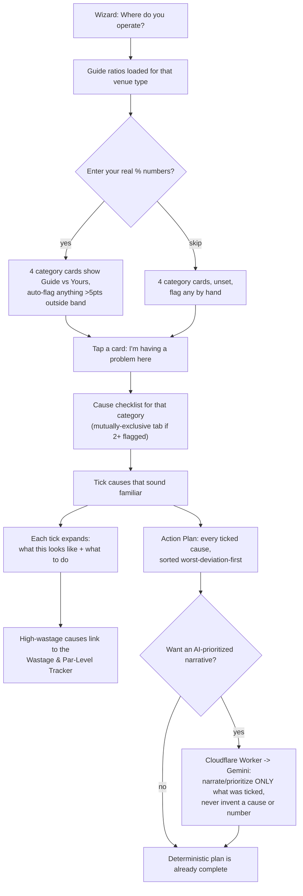

# Cost Structure Checker — build notes

New tool, built 2026-09-14 — the 10th tool in the Business Analysis dropdown. This doc assumes no prior context; everything needed is below. Companion file: `cost-structure-checker-settings-reference.xlsx` (same settings table below, in spreadsheet form).

**A nav-standard conflict was found and fixed as part of this build — see the very end of this doc before anything else if you're only reading one section.**

---

## 1. What this tool does, in one paragraph

Pick a venue type → optionally enter your real Ingredients / Overhead / Manpower / Margin percentages (skip this entirely if you don't know them yet — it's a bonus diagnostic aid, not a gate) → four category cards show your guide benchmark and auto-suggest which ones are running on the wrong side of it → tap any card, flagged or not, to open its full list of standard F&B cost-creep causes → tick whatever sounds familiar → each ticked cause expands into concrete, menu-engineering-grounded guidance right there on the page → a consolidated, impact-sorted Action Plan builds itself from everything ticked → optionally, send that same selection to Gemini for a short prioritized narrative on top of it, which never invents a cause you haven't ticked or a number you haven't given it.

A built-in **Wastage & Par-Level Tracker** sits inside the page for the single most commonly-cited cause (high wastage / no par levels): log opening stock, purchases, and closing counts for a period, and it works out consumption, wastage (if you also give it an expected usage), and a suggested order quantity from your own average usage.

## 2. Flow chart

(Renders as an actual diagram on GitHub; reads fine as plain text anywhere else.)

## 3. Why numbers are optional, not required

The core interaction asked for was "users can click which cost structures, and tick which one they are having problems" — so that's the interaction that works with zero data entry. The % inputs and the two-pie comparison (reusing the exact same `renderStructurePie`/`describePieSlice`/`polarPoint` code already in Interactive Costing Analysis, Margin Analysis, and Rental Calculator) are a bonus layer: if filled in, they auto-suggest which cards to open; if left blank, every card is still fully clickable and every cause checklist still fully available. Nothing about ticking a cause or reading its guidance ever requires a number.

## 4. The cause library

Lives entirely in `cost-structure-checker-content.js`, deliberately separated from the rendering logic in `cost-structure-checker.js` so it's the one file a non-coder could open and edit without reading any code that actually runs anything. 41 causes total, each with a "what this looks like" line and 3 concrete action steps grounded in standard F&B cost-control / menu-engineering practice:

| Category | Causes | A few examples |
|---|---|---|
| Ingredients & Packaging | 13 | High wastage, not practicing FIFO, no par levels, no yield testing, theoretical vs. actual variance not tracked |
| Overhead | 10 | Rent too high for revenue potential, energy inefficiency, no preventive maintenance, fixed vs. variable never separated |
| Manpower | 10 | Overstaffed for actual volume, high turnover, excess overtime, owner's own labor not counted as a cost |
| Margin | 8 | Menu not engineered to true cost, delivery-app commission not priced in, low volume below break-even, unpriced "value adds" |

Several causes deliberately point back at another tool already on this site rather than re-explaining something that tool already does properly — a "menu costing not updated" cause tells you to use Menu Calculator's Inflation Buffer %, a "menu not engineered" cause points at Margin Analysis's own Star/Plowhorse/Puzzle/Dog chart, and so on. This ties the diagnostic back into the rest of the product suite instead of duplicating logic.

**To add a new cause:** open `cost-structure-checker-content.js`, copy an existing cause block inside the right category's `causes` array, edit the four fields (`id`, `label`, `looksLike`, `actions`). Nothing else needs to change — the page picks it up automatically.

## 5. Diagnostic logic

- **Guide ratios**: the same `GUIDE_RATIOS` table (home/stall/truck/store) already used by Interactive Costing Analysis, Margin Analysis, and Rental Calculator — copied here rather than shared at runtime, same "each page stays independent, no build step" reasoning those files already state in their own comments. If those numbers are ever deliberately retuned elsewhere, this file needs the same edit by hand.
- **Band tolerance**: a category counts as "Running high"/"Running low" once the entered % sits more than **5 points** outside its guide number — loose enough that normal month-to-month noise doesn't false-flag something (`BAND_TOLERANCE_PTS` in `cost-structure-checker.js`).
- **Problem direction**: Ingredients/Overhead/Manpower are a problem when running *high*; Margin is a problem when running *low*. One `badDirection` flag per category (in `CATEGORY_META`) is what lets every status check use the same function without a single Margin-specific `if` anywhere in the render code.
- **Auto-suggest, always overridable**: a category outside the band gets pre-flagged with a "suggested" badge, but tapping its card always toggles the flag regardless of what the numbers say — a gut feeling that something's off is a perfectly good reason to check, and the tool never argues with that.

## 6. Wastage & Par-Level Tracker — the mechanics

Directly built from the example given: *"a table of ingredients usage, where they can track wastage and plan better use... when they know daily how much an order is, so project it and prepare only that amount."*

Per row: Ingredient, Unit, Opening stock, Purchased, Closing (counted), Expected usage (optional).
Computed: **Consumed** = opening + purchased − closing (clamped at 0, defensive against a counting mistake). **Wastage** = consumed − expected usage, only shown once an expected usage is entered — no expected usage means there's nothing to compare consumption against, so it honestly shows "—" rather than pretending to know. **Avg/day** = consumed ÷ period length. **Suggested par** = avg/day × (lead time + safety buffer) — a standard inventory par-level formula, giving a real "order up to this number" target instead of a guess.

Shared settings above the table (period length, lead time, safety buffer) apply to every row — a per-row version of lead time/safety buffer would be more precise (different ingredients genuinely have different supplier lead times) but was judged not worth the extra table width for a first version; flagged in the KIV list below.

## 7. The AI layer — deterministic first, AI optional

Same shape as every other AI-touched tool on this site (Market Radar's insight button, Food Worth's recipe breakdown, Crypto Radar's AI read): the tool is **completely usable with zero Worker configured** — every cause, every action step, the whole Action Plan, all render from `CAUSE_LIBRARY` with no network call at all. The "Get your AI action plan" button is a bonus layer that sends exactly what's already been ticked (category, cause ids, cause labels, entered numbers if any, an optional freeform notes field) to a small Cloudflare Worker, which asks Gemini to prioritize and narrate — never to diagnose a new cause or invent a number not already given. See `cost-structure-checker-proxy-worker.js`'s own `buildPrompt()` for the exact hard rules given to it.

## 8. UI/UX standard compliance (2026-09-08 AI_BUILD_BRIEF.md rule)

AI_BUILD_BRIEF.md's UI/UX standards section states: *"if you're building more than one independently-togglable panel, make opening one close the others rather than letting them stack."* This directly shaped one design decision worth flagging explicitly: when 2+ categories are flagged at once, their cause checklists do **not** stack on the page — only one is shown at a time, switched via a small tab row (reusing `.menu-tabs`/`.menu-tab-btn` exactly as-is, the same component Menu Calculator's dish tabs and Rental Calculator's equipment tabs already use for "only the active one's full card is shown"). Ticked causes are unaffected by which tab is currently showing, and the Action Plan section at the bottom always aggregates across *every* flagged category regardless — cross-category comparison happens there, not by viewing two checklists side by side.

**Worth flagging, not fixing here:** Margin Analysis's own four calc-tabs and Rental Calculator's own four calc-tabs are both explicitly documented, in their own file comments, as deliberately *independent* toggles ("NOT a mutually-exclusive switcher... opening one does not close another") — predating this UI/UX standard, or at least not yet updated to match it. This build follows the newer, explicitly-stated rule rather than the older precedent; reconciling those two tools to match (or confirming they're an intentional exception) is a call for whoever owns that decision, not something changed here.

## 9. Nav — the fork this build found and fixed

Two separate copies of `NAV_ORDER_STANDARD.md` had drifted apart. One (last touched 2026-09-08) already knew Rental Calculator existed at position 8, and had reserved positions 9/10/11 for Market Radar, **Cost Structure Checker**, and QR Listing Creator by exactly those names. A second, separate copy — apparently started from an older version of the file, before Rental Calculator's own entry existed — was seemingly the one on hand when Market Radar was actually built on 2026-09-12: it lists Market Radar as the *eighth* tool and never mentions Rental Calculator at all.

The live symptom, confirmed directly against both pages' own markup: `rental-calculator.html`'s nav dropdown doesn't list Market Radar; `market-radar.html`'s nav dropdown doesn't list Rental Calculator. Each page was built correctly against *a* copy of the standard — just not the same one.

**Fixed in this build**: `NAV_ORDER_STANDARD.md` is rewritten to the reconciled 10-item order — 1-8 unchanged, **9. Market Radar**, **10. Cost Structure Checker** (moved out of "reserved" into the real numbered list, since both now exist), QR Listing Creator still reserved at 11. `cost-structure-checker.html`'s own nav already uses this full, correct 10-item list. See that file's own changelog entry for a rule on how to reconcile this class of problem if it ever happens again (cross-check each tool's own script build-date banner rather than trusting either fork's numbering).

**Not fixed here, by design, same as every prior tool addition**: the other 12 pages' own nav dropdowns are not patched in this build — `menu-calculator.html`, `overhead-manpower-calculator.html`, `printing-calculator.html`, `interactive-costing-analysis.html`, `margin-audit-calculator.html`, `food-worth-calculator.html`, `crypto-radar.html`, `rental-calculator.html`, `market-radar.html`, `index.html`, `about.html`, `services.html`, `contact.html` all still need the corrected 10-item block pasted in during a central reconciliation pass, exactly as `NAV_ORDER_STANDARD.md`'s own "Canonical markup" section provides it verbatim, ready to copy.

---

## Settings reference

| Setting | Current value | Where to change it |
|---|---|---|
| Guide ratios per venue (ingredients/overhead/manpower/margin) | home 55/15/15/15, stall 50/20/15/15, truck 42/20/23/15, store 35/20/30/15 | `GUIDE_RATIOS`, `cost-structure-checker-content.js` |
| Band tolerance before "Within range" becomes "High"/"Low" | 5 percentage points | `BAND_TOLERANCE_PTS`, `cost-structure-checker.js` |
| Wastage tracker: default period length | 7 days | `DEFAULT_PERIOD_DAYS`, `cost-structure-checker.js` |
| Wastage tracker: default supplier lead time | 2 days | `DEFAULT_LEAD_TIME_DAYS`, `cost-structure-checker.js` |
| Wastage tracker: default safety buffer | 1 day | `DEFAULT_SAFETY_BUFFER_DAYS`, `cost-structure-checker.js` |
| Cause library size per category | Ingredients 13, Overhead 10, Manpower 10, Margin 8 | `CAUSE_LIBRARY`, `cost-structure-checker-content.js` |
| AI daily usage cap (per browser) | 20 | `MAX_ANALYSES_PER_DAY`, `cost-structure-checker.js` |
| Cloudflare Worker URL | needs pasting after deploy | `WORKER_ENDPOINT`, `cost-structure-checker.js` |
| Gemini model used | `gemini-flash-lite-latest` | `GEMINI_MODEL`, `cost-structure-checker-proxy-worker.js` |
| Gemini max output tokens / temperature for the action plan | 420 tokens / 0.4 | `generationConfig`, `cost-structure-checker-proxy-worker.js` |
| Websites allowed to call the Worker (CORS) | `reysourcez.com`, `www.reysourcez.com` | `ALLOWED_ORIGINS`, `cost-structure-checker-proxy-worker.js` |
| `styles.css` version referenced | `v=16` | `<link>` tag, `cost-structure-checker.html` |

## Jargon index

Built into the page itself as a collapsible section (`renderJargon()` reads from `JARGON` in `cost-structure-checker-content.js`, matching Crypto Radar's own glossary-from-one-array pattern) — 13 terms: food cost %, prime cost, FIFO, par level, yield %, theoretical vs. actual cost variance, contribution margin, menu engineering (Stars/Plowhorses/Puzzles/Dogs), COGS, break-even point, cost creep, fixed vs. variable overhead, SOP. Full wording lives in that one array; not duplicated here to avoid two copies drifting apart, same reasoning as everything above.

## Deploy checklist

- [ ] `cost-structure-checker.html`, `cost-structure-checker-content.js`, `cost-structure-checker.js` → push to GitHub Pages as usual.
- [ ] `cost-structure-checker-proxy-worker.js` → deploy to Cloudflare Workers (see its own header for the exact steps) if the AI action-plan button should work — **optional**, everything else on the page works fully without it.
- [ ] Paste the deployed Worker's URL into `WORKER_ENDPOINT` near the top of `cost-structure-checker.js`.
- [ ] `NAV_ORDER_STANDARD.md` → replace the existing file with this one; it's the reconciled version.
- [ ] Central nav-reconciliation pass (not done in this build, per standing convention): paste the corrected 10-item block from `NAV_ORDER_STANDARD.md`'s own "Canonical markup" section into the 12 other pages listed in its "Pages this currently applies to" section.

## Testing done

`node --check` clean on all three JS files (content, logic, Worker). Cross-checked every `getElementById` call in the logic file against a real `id="..."` in the HTML — zero mismatches, including the four dynamically-built `csc-pct-{category}` ids. HTML tag balance verified across every structural tag. Confirmed no top-level name collides between the content file and the logic file (they share one global scope via two plain `<script>` tags, so a real collision there would throw "already declared" at parse time in a browser — checked directly, not just assumed). Traced the wastage-tracker formulas and the impact-sort ("−1 for unset" trick, so an un-entered category naturally sorts last in a descending sort with no special-casing needed) by hand against a few worked examples.

**Not done, given there's no way to render an actual browser from here:** clicking through it on a phone screen — especially the mutually-exclusive cause-tabs when 3-4 categories are flagged at once, and whether the Wastage & Par-Level Tracker's 12-column table scrolls sensibly under 400px.

---

## KIV (not built this round)

- **Per-row lead time / safety buffer** in the Wastage & Par-Level Tracker, instead of one shared setting for the whole table — more accurate (a fresh-produce item and a dry-goods item genuinely have different supplier lead times) but adds table width; judged not worth it for a first version.
- **Auto-pull computed % from Margin Analysis or Interactive Costing Analysis**, instead of typing the four percentages in by hand. Both of those tools already compute this exact mix internally (`structureMixFromTotals()` / `structureMix()`), but neither currently *broadcasts* it over `costing-sync.js` — only their raw cost inputs get broadcast today, not the derived percentage mix. This page deliberately doesn't include `costing-sync.js` at all yet, for exactly this reason (an unused sync listener with nothing to listen to is worse than no listener) — see the comment above the `<script>` tags in `cost-structure-checker.html`. Adding the broadcast is a small, contained edit to those two other files' own `renderStructureComparison()`/`recalculate()` functions, not made here since it touches files this build doesn't own.
- **Reconciling Margin Analysis's and Rental Calculator's own calc-tabs** against the newer "don't stack independently-togglable panels" UI/UX standard this build followed — see section 8 above. Not changed here; flagged for whoever owns that call.
- **Central nav reconciliation** across the other 12 pages — see the Deploy checklist above.

## Version history

- **v1.0 (2026-09-14)** — Initial build. Wizard, optional %-entry with two-pie guide comparison, 4-category diagnostic cards, 41-cause library across Ingredients/Overhead/Manpower/Margin, mutually-exclusive cause-checklist tabs, Wastage & Par-Level Tracker, deterministic impact-sorted Action Plan, optional Gemini-narrated AI plan via Cloudflare Worker proxy, jargon index, methodology section, Save as PDF, floating quick-nav. Also: reconciled a documentation fork in `NAV_ORDER_STANDARD.md` (see section 9) and confirmed the new page complies with AI_BUILD_BRIEF.md's 2026-09-08 UI/UX standards (top-right Save as PDF, bottom-right floating quick-nav, no stacked independently-togglable panels, natural-length tooltips).
