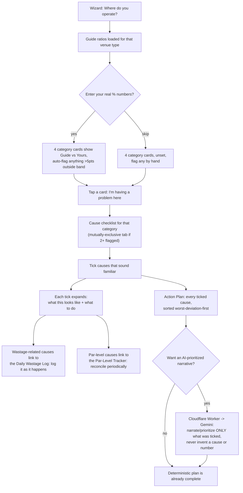

# Cost Structure Checker — build notes

New tool, built 2026-09-14 — the 10th tool in the Business Analysis dropdown. This doc assumes no prior context; everything needed is below. Companion files: `cost-structure-checker-settings-reference.xlsx` (same settings table below, in spreadsheet form) and `WASTAGE_TOOLS_PLACEMENT_NOTES.md` (2026-09-20 — the "should the Daily Wastage Log / Wastage & Par-Level Tracker live on a different page instead?" question, settled: no — read that file before relitigating it).

**A nav-standard conflict was found and fixed as part of this build — see the very end of this doc before anything else if you're only reading one section.**

---

## 1. What this tool does, in one paragraph

Pick a venue type → optionally enter your real Ingredients / Overhead / Manpower / Margin percentages (skip this entirely if you don't know them yet — it's a bonus diagnostic aid, not a gate) → four category cards show your guide benchmark and auto-suggest which ones are running on the wrong side of it → tap any card, flagged or not, to open its full list of standard F&B cost-creep causes → tick whatever sounds familiar → each ticked cause expands into concrete, menu-engineering-grounded guidance right there on the page → a consolidated, impact-sorted Action Plan builds itself from everything ticked → optionally, send that same selection to Gemini for a short prioritized narrative on top of it, which never invents a cause you haven't ticked or a number you haven't given it.

A built-in **Daily Wastage Log** and **Wastage & Par-Level Tracker** sit inside the page for the single most commonly-cited cause (high wastage / no par levels) — two genuinely different, complementary tools rather than one tool twice. See section 6 below for why both exist rather than just one.

## 2. Flow chart

(Renders as an actual diagram on GitHub; reads fine as plain text anywhere else.)

## 3. Why numbers are optional, not required

The core interaction asked for was "users can click which cost structures, and tick which one they are having problems" — so that's the interaction that works with zero data entry. The % inputs and the two-pie comparison (reusing the exact same `renderStructurePie`/`describePieSlice`/`polarPoint` code already in Interactive Costing Analysis, Margin Analysis, and Rental Calculator) are a bonus layer: if filled in, they auto-suggest which cards to open; if left blank, every card is still fully clickable and every cause checklist still fully available. Nothing about ticking a cause or reading its guidance ever requires a number.

## 4. The cause library

Lives entirely in `cost-structure-checker-content.js`, deliberately separated from the rendering logic in `cost-structure-checker.js` so it's the one file a non-coder could open and edit without reading any code that actually runs anything. 44 causes total, each with a "what this looks like" line and 3 concrete action steps grounded in standard F&B cost-control / menu-engineering practice:

| Category | Causes | A few examples |
|---|---|---|
| Ingredients & Packaging | 16 | High wastage, burnt/overcooked, spillage, not practicing FIFO, no par levels, customer returns not tracked, theoretical vs. actual variance not tracked |
| Overhead | 10 | Rent too high for revenue potential, energy inefficiency, no preventive maintenance, fixed vs. variable never separated |
| Manpower | 10 | Overstaffed for actual volume, high turnover, excess overtime, owner's own labor not counted as a cost |
| Margin | 8 | Menu not engineered to true cost, delivery-app commission not priced in, low volume below break-even, unpriced "value adds" |

Three of the sixteen Ingredients causes (burnt/overcooked, spillage/handling, customer returns) were added after a user shared a real operational SOP form (`SOP-KIT-WS01`, see section 6a) — its six wastage reason codes were checked against the existing library one by one: two already mapped cleanly onto existing causes, three genuinely didn't and became new causes, and one (unrecorded tasting/sampling) tightened an existing cause's wording rather than needing a wholly new entry.

Several causes deliberately point back at another tool already on this site rather than re-explaining something that tool already does properly — a "menu costing not updated" cause tells you to use Menu Calculator's Inflation Buffer %, a "menu not engineered" cause points at Margin Analysis's own Star/Plowhorse/Puzzle/Dog chart, and so on. This ties the diagnostic back into the rest of the product suite instead of duplicating logic.

**To add a new cause:** open `cost-structure-checker-content.js`, copy an existing cause block inside the right category's `causes` array, edit the four fields (`id`, `label`, `looksLike`, `actions`). Nothing else needs to change — the page picks it up automatically.

## 5. Diagnostic logic

- **Guide ratios**: the same `GUIDE_RATIOS` table (home/stall/truck/store) already used by Interactive Costing Analysis, Margin Analysis, and Rental Calculator — copied here rather than shared at runtime, same "each page stays independent, no build step" reasoning those files already state in their own comments. If those numbers are ever deliberately retuned elsewhere, this file needs the same edit by hand.
- **Band tolerance**: a category counts as "Running high"/"Running low" once the entered % sits more than **5 points** outside its guide number — loose enough that normal month-to-month noise doesn't false-flag something (`BAND_TOLERANCE_PTS` in `cost-structure-checker.js`).
- **Problem direction**: Ingredients/Overhead/Manpower are a problem when running *high*; Margin is a problem when running *low*. One `badDirection` flag per category (in `CATEGORY_META`) is what lets every status check use the same function without a single Margin-specific `if` anywhere in the render code.
- **Auto-suggest, always overridable**: a category outside the band gets pre-flagged with a "suggested" badge, but tapping its card always toggles the flag regardless of what the numbers say — a gut feeling that something's off is a perfectly good reason to check, and the tool never argues with that.

## 6. Daily Wastage Log and Wastage & Par-Level Tracker — two tools, not one twice

Both were built around a real operational document a user shared directly: a Daily Wastage Sheet (`SOP-KIT-WS01`, "Borang Kawalan Kebocoran & Pembaziran Dapur Harian") already in use in an actual Malaysian kitchen. Worth being explicit about why there are two rather than one, since on the surface they both compute "wastage":

- **Daily Wastage Log** is an **event log** — the source form's own model exactly: log each wastage event *as it happens*, with a time, item, category, quantity, an estimated RM cost, one of six reason codes (A: expired/spoiled, B: burnt/overcooked, C: spilled/dropped, D: customer return, E: wrong cut/over-portion, F: unrecorded taste-test), and a corrective-action note. Sums to a daily RM total, the same `JUMLAH KESELURUHAN HARIAN` the source form computes by hand. Tells you *why* wastage happened, in the moment — but only catches what staff actually remember to write down.
- **Wastage & Par-Level Tracker** is a **period reconciliation** — count stock at the start and end of a week (or whatever period), back-calculate total consumption, and compare it against an expected usage if you have one. Catches everything that left the shelf, including anything the daily log missed — but tells you nothing about *why*.

A kitchen running only one of the two has a real, specific blind spot the other one covers. They're presented as sequential, always-visible sections (Daily Wastage Log first, Tracker second) rather than tabs, since they're complementary steps in one workflow, not competing views of the same thing — the "don't stack independently-togglable panels" rule from section 8 below doesn't apply to two panels that aren't alternatives of each other.

**Reason codes are used verbatim from the source form** (`REASON_CODES` in `cost-structure-checker-content.js`) rather than invented fresh, since a business already running that SOP may have staff already trained on exactly those six letters. The "Category" column's preset options (Protein / Vegetable / Dairy / Dry goods / Beverage / Prepared dish / Other) are **not** from the source form — it left that column's values undefined — so this is a reasonable general default, not a source-verified list; flagged here in case that matters.

The "Form ref" field auto-fills as `WS-YYYYMMDD` from the date entered, mirroring the source form's own `NO. RUJUKAN BORANG` field exactly — display-only, nothing is stored or needs to be unique.

### Daily Wastage Log — the mechanics

Per row: Time, Item, Category, Quantity/weight (free text — the source form itself just says "KUANTITI / BERAT" with no fixed unit), Estimated cost (RM), Reason code, Notes/corrective action. **Daily total** = sum of the Estimated cost column, recalculated on every keystroke. Outlet/date/shift/head chef/staff are simple text fields at the top, and Prepared-by/Confirmed-by/Reviewed-by are simple text fields at the bottom, mirroring the source form's own three-tier sign-off — these are typed names, not real signatures (a stateless browser tool has no persistence or authentication to back a real digital signature with), intended to be filled in digitally and then printed via Save as PDF as an actual replacement for a paper copy of this exact form.

### Wastage & Par-Level Tracker — the mechanics

Directly built from the example given: *"a table of ingredients usage, where they can track wastage and plan better use... when they know daily how much an order is, so project it and prepare only that amount."*

Per row: Ingredient, Unit, Opening stock, Purchased, Closing (counted), Expected usage (optional).
Computed: **Consumed** = opening + purchased − closing (clamped at 0, defensive against a counting mistake). **Wastage** = consumed − expected usage, only shown once an expected usage is entered — no expected usage means there's nothing to compare consumption against, so it honestly shows "—" rather than pretending to know. **Avg/day** = consumed ÷ period length. **Suggested par** = avg/day × (lead time + safety buffer) — a standard inventory par-level formula, giving a real "order up to this number" target instead of a guess.

Shared settings above the table (period length, lead time, safety buffer) apply to every row — a per-row version of lead time/safety buffer would be more precise (different ingredients genuinely have different supplier lead times) but was judged not worth the extra table width for a first version; flagged in the KIV list below.

## 7. The AI layer — deterministic first, AI optional

Same shape as every other AI-touched tool on this site (Market Radar's insight button, Food Worth's recipe breakdown, Crypto Radar's AI read): the tool is **completely usable with zero Worker configured** — every cause, every action step, the whole Action Plan, all render from `CAUSE_LIBRARY` with no network call at all. The "Get your AI action plan" button is a bonus layer that sends exactly what's already been ticked (category, cause ids, cause labels, entered numbers if any, an optional freeform notes field) to a small Cloudflare Worker, which asks Gemini to prioritize and narrate — never to diagnose a new cause or invent a number not already given. See `cost-structure-checker-proxy-worker.js`'s own `buildPrompt()` for the exact hard rules given to it.

## 8. UI/UX standard compliance (2026-09-08 AI_BUILD_BRIEF.md rule)

AI_BUILD_BRIEF.md's UI/UX standards section states: *"if you're building more than one independently-togglable panel, make opening one close the others rather than letting them stack."* This directly shaped one design decision worth flagging explicitly: when 2+ categories are flagged at once, their cause checklists do **not** stack on the page — only one is shown at a time, switched via a small tab row (reusing `.menu-tabs`/`.menu-tab-btn` exactly as-is, the same component Menu Calculator's dish tabs and Rental Calculator's equipment tabs already use for "only the active one's full card is shown"). Ticked causes are unaffected by which tab is currently showing, and the Action Plan section at the bottom always aggregates across *every* flagged category regardless — cross-category comparison happens there, not by viewing two checklists side by side.

**Worth flagging, not fixing here:** Margin Analysis's own four calc-tabs and Rental Calculator's own four calc-tabs are both explicitly documented, in their own file comments, as deliberately *independent* toggles ("NOT a mutually-exclusive switcher... opening one does not close another") — predating this UI/UX standard, or at least not yet updated to match it. This build follows the newer, explicitly-stated rule rather than the older precedent; reconciling those two tools to match (or confirming they're an intentional exception) is a call for whoever owns that decision, not something changed here.

## 9. Nav — the fork this build found and fixed

Two separate copies of `NAV_ORDER_STANDARD.md` had drifted apart. One (last touched 2026-09-08) already knew Rental Calculator existed at position 8, and had reserved positions 9/10/11 for Market Radar, **Cost Structure Checker**, and QR Listing Creator by exactly those names. A second, separate copy — apparently started from an older version of the file, before Rental Calculator's own entry existed — was seemingly the one on hand when Market Radar was actually built on 2026-09-12: it lists Market Radar as the *eighth* tool and never mentions Rental Calculator at all.

The live symptom, confirmed directly against both pages' own markup: `rental-calculator.html`'s nav dropdown doesn't list Market Radar; `market-radar.html`'s nav dropdown doesn't list Rental Calculator. Each page was built correctly against *a* copy of the standard — just not the same one.

**Fixed in this build**: `NAV_ORDER_STANDARD.md` is rewritten to the reconciled 10-item order — 1-8 unchanged, **9. Market Radar**, **10. Cost Structure Checker** (moved out of "reserved" into the real numbered list, since both now exist), QR Listing Creator still reserved at 11. `cost-structure-checker.html`'s own nav already uses this full, correct 10-item list. See that file's own changelog entry for a rule on how to reconcile this class of problem if it ever happens again (cross-check each tool's own script build-date banner rather than trusting either fork's numbering).

**Not fixed here, by design, same as every prior tool addition**: the other 12 pages' own nav dropdowns are not patched in this build — `menu-calculator.html`, `overhead-manpower-calculator.html`, `printing-calculator.html`, `interactive-costing-analysis.html`, `margin-audit-calculator.html`, `food-worth-calculator.html`, `crypto-radar.html`, `rental-calculator.html`, `market-radar.html`, `index.html`, `about.html`, `services.html`, `contact.html` all still need the corrected 10-item block pasted in during a central reconciliation pass, exactly as `NAV_ORDER_STANDARD.md`'s own "Canonical markup" section provides it verbatim, ready to copy.

---

## Settings reference

| Setting | Current value | Where to change it |
|---|---|---|
| Guide ratios per venue (ingredients/overhead/manpower/margin) | home 55/15/15/15, stall 50/20/15/15, truck 42/20/23/15, store 35/20/30/15 | `GUIDE_RATIOS`, `cost-structure-checker-content.js` |
| Band tolerance before "Within range" becomes "High"/"Low" | 5 percentage points | `BAND_TOLERANCE_PTS`, `cost-structure-checker.js` |
| Wastage tracker: default period length | 7 days | `DEFAULT_PERIOD_DAYS`, `cost-structure-checker.js` |
| Wastage tracker: default supplier lead time | 2 days | `DEFAULT_LEAD_TIME_DAYS`, `cost-structure-checker.js` |
| Wastage tracker: default safety buffer | 1 day | `DEFAULT_SAFETY_BUFFER_DAYS`, `cost-structure-checker.js` |
| Cause library size per category | Ingredients 16, Overhead 10, Manpower 10, Margin 8 | `CAUSE_LIBRARY`, `cost-structure-checker-content.js` |
| Daily Wastage Log reason codes | 6 codes, A\u2013F, verbatim from source SOP form | `REASON_CODES`, `cost-structure-checker-content.js` |
| Daily Wastage Log category presets | Protein, Vegetable, Dairy, Dry goods, Beverage, Prepared dish, Other | `WASTAGE_LOG_CATEGORIES`, `cost-structure-checker-content.js` |
| AI daily usage cap (per browser) | 20 | `MAX_ANALYSES_PER_DAY`, `cost-structure-checker.js` |
| Cloudflare Worker URL | needs pasting after deploy | `WORKER_ENDPOINT`, `cost-structure-checker.js` |
| Gemini model used | `gemini-flash-lite-latest` | `GEMINI_MODEL`, `cost-structure-checker-proxy-worker.js` |
| Gemini max output tokens / temperature for the action plan | 420 tokens / 0.4 | `generationConfig`, `cost-structure-checker-proxy-worker.js` |
| Websites allowed to call the Worker (CORS) | `reysourcez.com`, `www.reysourcez.com` | `ALLOWED_ORIGINS`, `cost-structure-checker-proxy-worker.js` |
| `styles.css` version referenced | `v=16` | `<link>` tag, `cost-structure-checker.html` |

## Jargon index

Built into the page itself as a collapsible section (`renderJargon()` reads from `JARGON` in `cost-structure-checker-content.js`, matching Crypto Radar's own glossary-from-one-array pattern) — 13 terms: food cost %, prime cost, FIFO, par level, yield %, theoretical vs. actual cost variance, contribution margin, menu engineering (Stars/Plowhorses/Puzzles/Dogs), COGS, break-even point, cost creep, fixed vs. variable overhead, SOP. Full wording lives in that one array; not duplicated here to avoid two copies drifting apart, same reasoning as everything above.

## Deploy checklist

- [ ] `cost-structure-checker.html`, `cost-structure-checker-content.js`, `cost-structure-checker.js` → push to GitHub Pages as usual.
- [ ] `cost-structure-checker-proxy-worker.js` → deploy to Cloudflare Workers (see its own header for the exact steps) if the AI action-plan button should work — **optional**, everything else on the page works fully without it.
- [ ] Paste the deployed Worker's URL into `WORKER_ENDPOINT` near the top of `cost-structure-checker.js`.
- [ ] `NAV_ORDER_STANDARD.md` → replace the existing file with this one; it's the reconciled version.
- [ ] Central nav-reconciliation pass (not done in this build, per standing convention): paste the corrected 10-item block from `NAV_ORDER_STANDARD.md`'s own "Canonical markup" section into the 12 other pages listed in its "Pages this currently applies to" section.

## Testing done

`node --check` clean on all three JS files (content, logic, Worker). Cross-checked every `getElementById` call in the logic file against a real `id="..."` in the HTML — zero mismatches, including the four dynamically-built `csc-pct-{category}` ids. HTML tag balance verified across every structural tag. Confirmed no top-level name collides between the content file and the logic file (they share one global scope via two plain `<script>` tags, so a real collision there would throw "already declared" at parse time in a browser — checked directly, not just assumed). Traced the wastage-tracker formulas and the impact-sort ("−1 for unset" trick, so an un-entered category naturally sorts last in a descending sort with no special-casing needed) by hand against a few worked examples.

**Not done, given there's no way to render an actual browser from here:** clicking through it on a phone screen — especially the mutually-exclusive cause-tabs when 3-4 categories are flagged at once, and whether the Wastage & Par-Level Tracker's 12-column table scrolls sensibly under 400px.

---

## KIV (not built this round)

- **Per-row lead time / safety buffer** in the Wastage & Par-Level Tracker, instead of one shared setting for the whole table — more accurate (a fresh-produce item and a dry-goods item genuinely have different supplier lead times) but adds table width; judged not worth it for a first version.
- **Auto-pull computed % from Margin Analysis or Interactive Costing Analysis**, instead of typing the four percentages in by hand. Both of those tools already compute this exact mix internally (`structureMixFromTotals()` / `structureMix()`), but neither currently *broadcasts* it over `costing-sync.js` — only their raw cost inputs get broadcast today, not the derived percentage mix. Adding the broadcast is a small, contained edit to those two other files' own `renderStructureComparison()`/`recalculate()` functions, not made here since it touches files this build doesn't own. **Partially addressed across v1.4 and v1.5**, but via a different, smaller mechanism than this bullet describes: Menu Calculator's export/broadcast (file import in v1.4, live `costing-sync.js` sync too as of v1.5) auto-fills Ingredients % specifically — see those changelog entries above. This bullet's own ask — the fuller %-mix broadcast from Margin Analysis/Costing Analysis, covering all four categories — is still completely open.
- **Overhead % / Manpower % auto-fill from Overhead & Manpower's own export** — that export shape (`overheadMonthly`, `manpowerMonthly`) is recognised by the file-import dispatcher but not actioned, since it's RM/month and this page has no revenue figure to divide by to get a %. Would need either a new "Monthly revenue" input added here, or a way to pull revenue from wherever Interactive Costing Analysis already has it — a call for whoever picks this up next, not guessed at.
- **v1.5's live-sync assumptions, unverified this session, worth a real check** — `costing-sync.js`, `menu-calculator.js`, `interactive-costing-analysis.js`, `margin-audit-calculator.js` and `styles.css` weren't available to inspect directly when v1.5 was built (only `NAV_RETROFIT_HOWTO.md` was in `/mnt/project/` by then). `initSync()` in `cost-structure-checker.js` assumes `costing-sync.js` exposes a global `rzListen(handler)` and fails safe (no-ops) if it doesn't — worth confirming that's still the real function name next time these files are on hand. Separately, CSC's synced-field badge was deliberately built as its own self-contained `.csc-synced-badge` (in this page's own `<style>` block) rather than assuming a shared `.synced-badge` exists in `styles.css`, precisely because that couldn't be checked this session — if a shared version does exist, worth switching to it for visual consistency once confirmed.
- **Reconciling Margin Analysis's and Rental Calculator's own calc-tabs** against the newer "don't stack independently-togglable panels" UI/UX standard this build followed — see section 8 above. Not changed here; flagged for whoever owns that call.
- **Central nav reconciliation** across the other 12 pages — see the Deploy checklist above.
- **Auto-suggesting a cause from Daily Wastage Log entries** — e.g., several reason-code-B (burnt/overcooked) entries in the log could reasonably nudge the "Burnt, overcooked, or spoiled in cooking" cause toward pre-ticked, the same way an entered % auto-suggests a flagged category. Not wired up in this build; the log and the cause checklist are currently independent of each other.
- **Category preset list for the Daily Wastage Log** (Protein/Vegetable/Dairy/etc.) is a reasonable default, not sourced from the reference SOP, which left that column undefined — worth confirming against real usage if the business has its own preferred categories.

## Version history

- **v1.5 (2026-09-24)** — Two unrelated pieces of work, both prompted directly by Treasurer this session. **(1) Live cross-tool sync, on top of v1.4's file import:** per Treasurer ("all that needs calc can call broadcast/payload from existing calc, and also from export import func"), CSC now also listens live over `costing-sync.js` (newly included \u2014 see the `<script>` tags), not just file import. The whole cross-tool section was refactored so both paths share exactly one function, `handleSyncPayload(data)`, per `CROSS_TOOL_IMPORT_STANDARD.md`'s own explicit rule against re-implementing field-mapping twice \u2014 `importDataFile()` now loops `data.blocks` and calls `handleSyncPayload({source: 'menu-calculator', ...})` once per dish, exactly matching that standard's worked example, instead of the v1.4 approach of computing the average directly off a raw file. A `syncedMenuBlocks` Map (keyed by `blockId`) holds every dish this page has heard about from either source, live or file, so a later update for the same dish overwrites rather than double-counts; Ingredients % recomputes from the full current set \u2014 same unweighted-average logic as v1.4, now just fed from two directions instead of one. A `markSynced()` badge on the Ingredients % label shows where the current number came from. **What's re-verified vs. what isn't, worth being explicit about:** the Menu Calculator and Overhead & Manpower payload shapes were re-confirmed this session directly against `CROSS_TOOL_IMPORT_STANDARD.md`'s own worked-example lines (not just recalled) \u2014 high confidence there. `costing-sync.js`, `menu-calculator.js`, `interactive-costing-analysis.js`, `margin-audit-calculator.js`, and `styles.css` were **not** available to check directly this session (`/mnt/project/` only had `NAV_RETROFIT_HOWTO.md` in it by the time this work happened), so two things are built defensively rather than confirmed: `rzListen()`'s exact name/behaviour in `costing-sync.js` (`initSync()` no-ops safely if it's not actually a function by that name, so a mismatch means live sync silently doesn't activate, not a broken page); and whether a `.synced-badge` component already exists elsewhere on the site (assumed it might, but rather than guess at its class name, CSC's badge uses its own self-contained `.csc-synced-badge`, defined in this page's own `<style>` block, so nothing here depends on an unverified assumption about shared CSS). Worth a real check against those five files' current content next time they're available, and worth an end-to-end test against a real Menu Calculator export or live tab \u2014 still neither has happened. **(2) Nav retrofit, per `NAV_RETROFIT_HOWTO.md`:** that doc listed this page under "not yet" and asks any session touching a listed page to do the retrofit immediately. Done: `site-config.js?v=1` and `nav-config.js?v=1` added as the first two `<script>` tags (before `costing-sync.js`, `nav-dropdown.js`, and everything else, per the doc), and the hand-typed 10-item `<ul class="nav-dropdown-menu">` (accurate as of the 2026-09-14 reconciliation, per v1.2/overview notes, but exactly the fragile hand-maintained list the retrofit exists to retire) emptied to `<!-- populated by nav-config.js -->`. Neither `site-config.js` nor `nav-config.js` was available to inspect this session either \u2014 not edited, per the doc's own instruction not to; the two `<script src>` references trust that both files already exist on the deployed site, on the strength of the doc's "Done" list naming six other pages that already depend on them successfully. `NAV_RETROFIT_HOWTO.md` itself updated to move this page from "Not yet" to "Done," per its own instruction to whoever does the retrofit. Confirming the dropdown actually renders correctly once deployed is explicitly **not this page's problem to debug further** if it's wrong \u2014 per the doc, that would mean the bug is in `nav-config.js` itself. `node --check` clean; every new/changed element id cross-checked against the HTML, zero mismatches; script cache-bust bumped `?v=4`\u2192`?v=5` (content.js unchanged, stays `?v=2`).
- **v1.4 (2026-09-22)** — First cross-tool file import, per `CROSS_TOOL_IMPORT_STANDARD.md`: a new "Import from Menu Calculator" button in the "Your numbers" box reads a Menu Calculator "Export data" file (`rzExportType: 'menu-calculator'`, the exact shape that standard's own worked example already documents \u2014 reused as-is rather than guessed at, and confirmed via Treasurer that the session building Menu Calculator's own export/broadcast is participating) and sets Ingredients % to the unweighted average food cost % (`costPerPortion \u00f7 sellingPrice \u00d7 100`) across every dish in the file that has both figures. `applyMenuCalculatorImport()` in `cost-structure-checker.js` carries the full reasoning in its own comment, including why the average is unweighted (the export carries no sales-volume field to weight by) and why `costBufferPct` is read but deliberately not folded into the number (it's Menu Calculator's own pricing-side buffer, not confirmed to mean the same thing as a true cost inflator). The in-page result message says exactly this every time it runs, and the field stays a normal editable input afterward \u2014 a real blended number always overwrites it by hand. An Overhead & Manpower export (`rzExportType: 'overhead-manpower-calculator'`) is recognised by the same dispatcher but deliberately not actioned yet \u2014 see the new KIV bullet below for why (RM/month, no revenue figure here to convert with) \u2014 importing one returns an honest explanation rather than a silent no-op or a generic "unrecognised file." This is file-import only, same shape as Costing Analysis's and Margin Analysis's own importers; CSC still has no live `costing-sync.js` listener (see the KIV bullet on this, still unbuilt), so nothing here is a live "Pull from" connector. `CROSS_TOOL_IMPORT_STANDARD.md`'s own "Pages this currently applies to" list updated to move this page from "not yet built" to importer-role (partial); that pass also caught and flagged (not fixed \u2014 not this session's file to fix) that the same list still named Market Radar as unbuilt, which it isn't. `node --check` clean on the updated `cost-structure-checker.js`; every `csc-import-*` id cross-checked against the HTML the same way prior versions were tested, zero mismatches. **Not done:** a real end-to-end test against an actual exported Menu Calculator file \u2014 none was on hand this session, so the import path was traced by hand against the shape `CROSS_TOOL_IMPORT_STANDARD.md` documents, not against live output. Worth confirming against a real file once Menu Calculator's own broadcast/export work lands. Script cache-bust bumped `?v=3` \u2192 `?v=4` (content.js unchanged, stays `?v=2`).
- **v1.3 (2026-09-21)** — Root-caused and confirmed (via a live browser console screenshot, not guesswork) why "+ Add entry" / "+ Add ingredient" did nothing on a deploy: the live `cost-structure-checker-content.js` was missing `REASON_CODES` and `WASTAGE_LOG_CATEGORIES` — both added in v1.1 alongside the Daily Wastage Log — meaning that file was never actually updated past v1.0 even though the HTML/main JS were. `renderReasonLegend()` threw on that missing global partway through `init()`, and because init() ran as one unguarded block, every step scheduled after it silently never ran: no initial rows, no listener at all on the Tracker's add button, no quick-nav, no AI-plan button. Not a bug in any file this project produced — a partial redeploy. Fixed structurally so this can't cascade the same way again: every `init()` section is now wrapped in a small `safeInit(label, fn)` that catches and `console.error`s its own failures, so one broken section (missing global, renamed id) can no longer take down every unrelated section after it, and still leaves a clear trail in the console pointing at exactly what failed — the same trail that made this one diagnosable in the first place. Both content.js and the main script's cache-bust bumped (`?v=1`→`?v=2` and `?v=2`→`?v=3` respectively) specifically so a redeploy can't silently continue serving the stale file.
  Also, per direct request: Daily Wastage Log and Wastage & Par-Level Tracker are no longer two stacked always-visible boxes — merged into one collapsible (`#csc-wastage-tools`, defaults CLOSED now, previously OPEN in v1.2) with a two-button tab switcher (`.csc-wastage-tabs`, reusing `.menu-tabs`/`.menu-tab-btn` as-is) inside it. Tab-switching only ever toggles `hidden` on a `.csc-wastage-panel`; neither panel's DOM (rows, typed values) is ever destroyed by switching tabs, collapsing the box, or printing — only each panel's own Reset button clears anything. `csc-wastage-log`/`csc-wastage-tracker` keep their exact ids from v1.0/v1.2 (now on the tab panels instead of on two top-level boxes) specifically so the six existing cause→tool links and the two quick-nav buttons needed zero changes to their `href`/`data-target` values — a new shared `revealSection(id)` (replacing v1.2's simpler open-closed-details delegate) opens the collapsible AND switches to the correct tab before the browser's own anchor-jump scroll happens, used by both the quick-nav handler and the generic in-page hash-link delegate so the logic isn't duplicated.
  Added, per direct request: a "Save this log as PDF" / "Save this tracker as PDF" button in each panel (`csc-wl-print` / `csc-wt-print`), scoped via a `body.csc-print-scope-log` / `-tracker` class added right before `window.print()` and removed right after (`printSection()`) — hides everything on the page except the one panel being saved, rather than the page-wide "Save as PDF" button's everything-forced-open behavior, which is unchanged and still shows both wastage panels regardless of which tab was on screen.
- **v1.2 (2026-09-20)** — Wastage & Par-Level Tracker made collapsible (`
`, same mechanics as Jargon/Methodology below), defaulting OPEN so the existing cause→tool anchor links land on a ready-to-use tool exactly as before rather than a collapsed summary bar. Two small bugs found and fixed while in this area: (1) the Jargon index and Methodology section's `<h2>` summaries never actually rendered a collapse/expand indicator — `.csc-collapsible-summary`'s chevron CSS only ever targeted `h3` (built for the per-jargon-term rows), so both top-level collapsibles were togglable with zero visual affordance; the CSS now covers `h2` too, fixing all three collapsibles in one pass. (2) A plain `<a href="#csc-wastage-log">`/`<a href="#csc-wastage-tracker">` tool link from a ticked cause does a native anchor-jump, bypassing the quick-nav's click handler entirely — so it wouldn't have opened a closed tracker on its own; a small delegated click listener now opens any closed `
` ahead of any in-page hash-link jump, not just quick-nav clicks. Also fixed: the Daily Wastage Log's "Form ref" field showed the literal 6 characters `\u2014` instead of an em dash on first load (real Unicode em dash now in the static HTML; `updateFormRef()` also now runs once at init to match the "wire the listener, then render once" pattern every other sub-tool on this page already follows) — and the same literal-escape-sequence bug existed in three of the Tracker's own column tooltips (Consumed/Wastage/Suggested par), now real en-dash/minus/multiply characters instead of `\u2212`/`\u2014`/`\u00d7`. **Not fixed, flagged only:** the identical literal-escape pattern also turned up in two comments in this HTML file (harmless — comments aren't rendered) and in this very notes file's own v1.1 entry below (harmless — internal docs, not user-facing); worth a search-and-fix across the OTHER tool pages sometime, since nothing here suggests it's unique to this one. See `WASTAGE_TOOLS_PLACEMENT_NOTES.md` for the placement question this session also answered (kept on this page, not moved) and the live-site findings that came out of researching it (a stale default branch on GitHub, and confirmed nav drift on Interactive Costing Analysis). `cost-structure-checker.js`'s script-build banner bumped to `2026-09-20-v1.2`; its `<script>` tag's cache-bust bumped to `?v=2` (content.js unchanged, stays at `?v=1`).
- **v1.1 (2026-09-15)** — Added the **Daily Wastage Log**, a real-time wastage event log modeled directly on a Malaysian kitchen SOP form a user shared (`SOP-KIT-WS01`), sitting alongside the existing Par-Level Tracker as a genuinely complementary tool rather than a duplicate — event log (what/why, as it happens) vs. period reconciliation (how much, in total). Carries the source form's own six reason codes (A–F) verbatim, a daily RM total, and outlet/date/shift/sign-off fields for a proper Save-as-PDF record. Cross-checking those six reason codes against the existing cause library surfaced three genuine gaps, now added as new Ingredients causes (burnt/overcooked, spillage/handling, customer returns not tracked) and one existing cause's wording tightened (comps/tasting) — cause library grows from 41 to 44. Quick-nav gained a fourth section button (Daily Log).
- **v1.0 (2026-09-14)** — Initial build. Wizard, optional %-entry with two-pie guide comparison, 4-category diagnostic cards, 41-cause library across Ingredients/Overhead/Manpower/Margin, mutually-exclusive cause-checklist tabs, Wastage & Par-Level Tracker, deterministic impact-sorted Action Plan, optional Gemini-narrated AI plan via Cloudflare Worker proxy, jargon index, methodology section, Save as PDF, floating quick-nav. Also: reconciled a documentation fork in `NAV_ORDER_STANDARD.md` (see section 9) and confirmed the new page complies with AI_BUILD_BRIEF.md's 2026-09-08 UI/UX standards (top-right Save as PDF, bottom-right floating quick-nav, no stacked independently-togglable panels, natural-length tooltips).
