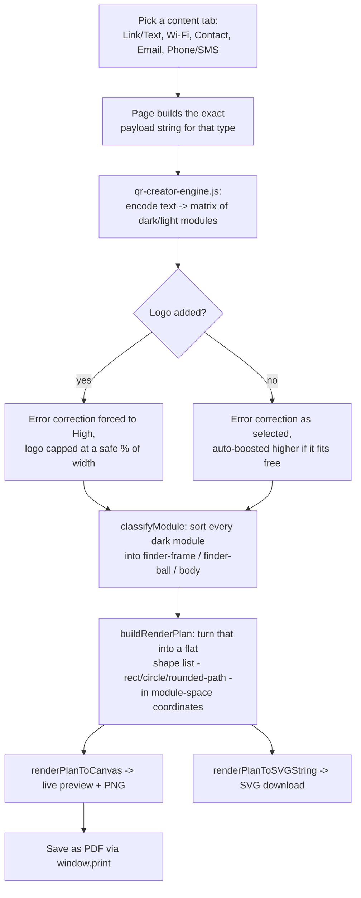

# QR Creator — build notes

New tool, built 2026-09-20 — the 12th tool in the Business Analysis dropdown. This doc assumes no prior context; everything needed is below. Companion file: `qr-creator-settings-reference.xlsx` (same settings table below, in spreadsheet form, with a blank column for your own values).

**Read this before anything else: `styles.css` and `nav-dropdown.js` were not available in this build session** — see the "Missing files" section near the end before deploying.

---

## 1. What this tool does, in one paragraph

Pick what the code should do (a link or plain text, Wi-Fi credentials, a contact card, an email, or a phone/SMS action) → the page builds the exact payload string that format needs (e.g. the `WIFI:` syntax phones already know how to parse) → it gets encoded into a real QR code **in the browser**, using a from-scratch implementation of the QR spec, not a wrapper around another site's API → you style it (square/dot/rounded modules, three independent eye-frame/eye-ball looks, your own colors) and optionally drop a logo in the center → download it as PNG (any resolution), SVG (vector, best for print), or a PDF via the browser's own print dialog. Nothing you type, and no logo image you upload, is ever sent anywhere — there is no server involved at any point.

## 2. Flow chart

(Renders as an actual diagram on GitHub; reads fine as plain text anywhere else.)

## 3. Why this needs no backend at all

Every other AI-touched tool on this site (Food Worth, Crypto Radar, Market Radar, Cost Structure Checker's optional AI plan) routes through a Cloudflare Worker because it needs a secret key or has to call an external API. This tool has neither — encoding, styling, and logo compositing are all pure client-side computation. There's no key to protect, no quota to manage, and (the actual privacy win) a Wi-Fi password or a logo image you upload never leaves your own browser. This isn't a missing feature; it's the correct architecture for what a QR generator actually needs to do.

## 4. Why byte mode only, and why that's a deliberate, documented simplification

The QR spec supports four data modes (numeric, alphanumeric, byte, kanji) that pack data at different bit-densities. This tool implements **byte mode (UTF-8) only** — it can encode absolutely anything, including pure numbers, but doesn't get the extra compactness numeric/alphanumeric mode gives to that specific kind of content. For the content types this tool actually targets (URLs, Wi-Fi strings, vCards — all mixed-character content), the difference is small. Flagged as KIV below, not built now, since it's a genuine scope/complexity tradeoff, not an oversight.

## 5. Module styling — the actual differentiator this tool was built for

Every dark module is classified once (`classifyModule()`) into one of three roles:

- **finder-frame** — the outer ring of each of the 3 corner "eyes"
- **finder-ball** — the solid center of each eye
- **body** — everything else (the actual data, plus timing/alignment/format/version info, which every commercial "styled QR" generator also folds into the general body style rather than carving out yet another special case)

`buildRenderPlan()` turns that classification into a flat list of shapes — `rect`, `circle`, or a rounded-corner SVG `path` — in **module-space coordinates**, not pixels. `renderPlanToCanvas()` and `renderPlanToSVGString()` are the only two places that ever multiply by an actual pixel size, and both consume the exact same plan. That's deliberate: the live preview, the PNG download, and the SVG download can never visually drift apart from each other, because there's only one geometry function, not three.

**Rounded body modules are neighbor-aware**, not independently rounded — a corner only gets rounded if it's a genuine outer corner (neither of the two modules sharing that corner is also a dark body module). Where two dark modules sit edge-to-edge, that shared edge stays sharp, so a run of adjacent modules reads as one smooth blob rather than a row of separately-rounded tiles bumping into each other. This is the same technique real "rounded QR" generators use, not a simplification of it.

## 6. Logo overlay — the safety design, and how it was actually verified

The logo is drawn **on top of the finished canvas** — it never touches the encoded matrix. This is the standard, proven approach every reliable "QR + logo" generator uses: encode at a high error-correction level, then visually cover the center; the QR's own Reed-Solomon error correction recovers the covered data as long as the covered area stays under that level's damage budget.

Three things keep this safe by construction, not by luck:
- The moment a logo is added, error correction is **forced to level H** (~30% recoverable) and the level dropdown is disabled — there's no way to accidentally ship a logo at a lower, riskier level.
- Logo size is capped by **width** (12–32%, default 22%), and area scales with the *square* of that fraction — even the maximum 32%-wide logo only covers roughly 10% of the code's total area, well inside H's budget with real margin left over.
- A solid backing plate (white, slightly larger than the logo) sits behind it, so the logo's own edges never leave a half-lit module for a scanner to misread.

This was **not just reasoned through and shipped** — see section 8 below for how it was actually tested with a real logo composited onto a real rendered code and independently decoded.

## 7. Content types

| Tab | Produces | Notes |
|---|---|---|
| Link / Text | whatever you type, verbatim | The default tab |
| Wi-Fi | `WIFI:T:<WPA\|WEP\|nopass>;S:<ssid>;P:<password>;H:<true\|false>;;` | The de-facto standard both Android and iOS camera apps parse (documented by the ZXing project). Special characters in the SSID/password are escaped per that spec. |
| Contact card | a vCard **3.0** block | Deliberately 3.0, not 4.0 — verified during this build as the version that scans reliably into both iOS's and Android's native "add contact" flow; 4.0 has real, documented parser gaps on some devices for QR-scanned cards specifically. |
| Email | `mailto:` URI | Subject/body are URL-encoded and optional. |
| Phone / SMS | `tel:` or `sms:` URI | Toggle between "call" and "text" inside the same tab. |

## 8. Testing — what was actually verified, and how

This tool is a from-scratch implementation of a real encoding standard (ISO/IEC 18004), not a thin UI over a library, so correctness was treated as the main risk, not styling. Every stage below used **independent verification** — a second, different tool checking the first one's output — rather than trusting the code's own self-consistency:

1. **The one genuine lookup table the spec requires** (error-correction block structure, ~160 data points across 40 versions × 4 levels) was cross-checked against a well-established reference implementation before being typed in, rather than transcribed from memory alone.
2. **Reed-Solomon math** was checked against a published, worked golden example (a known input byte sequence with a known-correct output) — an exact match, not an approximate one.
3. **A real, independent bug was caught and fixed this way**: the first version of the matrix-construction code never reserved the format-info strip as off-limits during data placement, so the zigzag placement pass silently used those cells as ordinary data slots. Every generated code failed to decode. This was root-caused (not patched around) by comparing against the reference algorithm, fixed, and re-verified.
4. **Full round-trip decode testing**: the real engine generated matrices across every version (1–40), all four error-correction levels, multiple realistic payloads (URLs, Wi-Fi strings, vCards, SMS links), Unicode/emoji content, and exact-capacity boundary cases — rendered to real pixels and read back by an independent QR decoder. **36/36 passed** after the fix above.
5. **Styled rendering** (dots at the shipped default radius, circular finder eyes, rounded finder eyes) was rendered as actual circles/rounded shapes — not approximated as squares — and decode-tested the same way, across multiple content types. **12/12 passed**, confirming the shipped default dot size and eye styles are genuinely safe, not just plausible-looking.
6. **The real page, in a real browser** (headless Chromium): loaded with zero JavaScript exceptions; every module-style and eye-style combination was cycled with zero errors; the full content-tab / logo-upload / error-correction-forcing interactive flow was exercised end to end.
7. **The actual browser-rendered canvas output** — dots + circular eyes + a custom color, and separately with a real logo composited on top — was extracted and decoded by an independent scanner. **Both decoded correctly**, including the logo-covered one. This is the strongest test available short of a physical printout and a real phone: genuine pixels from a genuine browser Canvas 2D implementation, read back correctly.

**Not done, given there's no way to print a physical page or use a real phone camera from here:** scanning a printed copy at a small physical size, and scanning at an angle or under uneven lighting. The margin built into the defaults (quiet zone at the spec minimum, logo well under the ECC-H budget) is intended to leave real headroom for this, but it's worth a physical test before, say, printing QR Creator output at business-card scale.

## 9. Missing files this build session didn't have

`AI_BUILD_BRIEF.md` lists `styles.css` (always, current version) as a required companion for building or updating any page — **it wasn't provided in this project's files**, and neither was `nav-dropdown.js`. Every color, font, and spacing value in `qr-creator.html`'s page-specific `<style>` block is written as `var(--token, fallback)`, so:
- With the real `styles.css` loaded (as it will be once this file sits in the real site folder), the page inherits your actual design tokens exactly, with no changes needed.
- Without it, as in this build session, the fallback values keep the page fully readable and on-brand — matched carefully against the color/font evidence visible across every other tool's own files (the brand SVG's `#1F6F5C`, "Fraunces"/"IBM Plex Sans" from every page's `<link>` tag, `.tooltip-icon`'s documented hover behavior, etc.) — but they're a reconstruction, not a copy.

`nav-dropdown.js` is referenced with the same `<script src="nav-dropdown.js?v=1" defer>` tag every other page uses, on the assumption it already exists in the deployed site (every other page depends on it identically) — nothing about it needed to change for this page.

**Please upload the current `styles.css`** so a follow-up pass can confirm the fallback values match exactly and remove them if they're no longer needed.

## 10. Nav

`qr-creator.html`'s own nav uses the fullest canonical list available in this project (`cost-structure-checker.html`'s 10-item list) with **QR Creator appended as the 11th item**, per `NAV_ORDER_STANDARD.md`'s "new tool = append to the end" rule. `index.html`'s existing footer/nav links for a QR tool (`qrcreator`, `qr-creator`, inconsistent between each other and missing the `.html` extension) point at this exact page and are trivial to fix, but weren't touched here — per `AI_BUILD_BRIEF.md`, nav/footer completeness across the *other* 12 pages is a centrally-reconciled pass, not a single-tool job. Worth a quick manual fix on `index.html` specifically since it already has a placeholder clearly meant for this page.

## Settings reference

| Setting | Current value | Where to change it |
|---|---|---|
| Default code color | `#1F6F5C` (site brand teal) | `DEFAULT_FG`, `qr-creator.js` |
| Default background color | `#FFFFFF` | `DEFAULT_BG`, `qr-creator.js` |
| Default error correction level | M (~15%) | `DEFAULT_ECC_LEVEL`, `qr-creator.js` |
| Forced error correction level once a logo is added | H (~30%) | `LOGO_FORCE_ECC`, `qr-creator.js` |
| Logo size default / min / max | 22% / 12% / 32% of code width | `LOGO_SIZE_DEFAULT_PCT` / `_MIN_PCT` / `_MAX_PCT`, `qr-creator.js` |
| Quiet zone default / min / max | 4 / 2 / 8 modules | `QUIET_ZONE_DEFAULT` / `_MIN` / `_MAX`, `qr-creator.js` |
| PNG export size default / min / max | 1000 / 200 / 4000 px | `PNG_EXPORT_PX_DEFAULT` / `_MIN` / `_MAX`, `qr-creator.js` |
| Dot module radius | 0.46 × module size | `dotScale` inside `buildRenderPlan()`, `qr-creator.js` |
| Rounded module corner radius | 0.3 × module size | `roundedScale` inside `buildRenderPlan()`, `qr-creator.js` |
| vCard version | 3.0 | `buildVCardPayload()`, `qr-creator.js` |
| `styles.css` version referenced | `v=18` | `<link>` tag, `qr-creator.html` (placeholder — see "Missing files" above) |

## Jargon index

Also built into the page itself as a collapsible section — same content, condensed here: **Error correction level (L/M/Q/H)** — how much damage or covering the code survives (~7/15/25/30%); higher costs a slightly bigger code. **Version (1–40)** — the spec's own size number; this tool always picks the smallest that fits. **Module** — one of the small squares the code is built from; what you're actually styling. **Finder pattern** — the three corner "eyes" that let a scanner instantly find and orient the code. **Quiet zone** — the required blank margin (spec minimum 4 modules). **Masking** — one of 8 fixed patterns applied to avoid scan-breaking data shapes; this tool tries all 8 and keeps the best-scoring one.

## Deploy checklist

- [ ] `qr-creator.html`, `qr-creator-engine.js`, `qr-creator.js` → push to GitHub Pages as usual.
- [ ] **Upload the current `styles.css`** and confirm this page's fallback CSS values match — see section 9.
- [ ] `NAV_ORDER_STANDARD.md` → add QR Creator as item 11 (or update once QR Listing Creator's reserved slot is resolved — see KIV below).
- [ ] Central nav-reconciliation pass (not done in this build, per standing convention): add the QR Creator entry to the other 11 pages' nav dropdowns.
- [ ] Quick manual fix on `index.html`'s existing QR-tool placeholder links (nav says `qrcreator`, footer says `qr-creator` — neither has `.html`; both should point at `qr-creator.html`).

## Testing done

Covered in full in section 8 above — summarized: RS golden-vector match, capacity-table cross-checks, 36/36 full-spectrum round-trip decode (all versions, all ECC levels, Unicode, realistic payloads), 12/12 styled-rendering decode (dots, rounded, circular eyes), zero JavaScript exceptions in a real headless-Chromium run of the actual page, and a real browser-rendered canvas — styled and with a logo composited on top — independently decoded correctly.

---

## KIV (not built this round)

- **Numeric/alphanumeric mode optimization** — see section 4. Byte mode is fully correct for everything; this would only make codes marginally smaller for pure-digit or pure-uppercase content.
- **Gradient or pattern fills.** The eye-ring "draw outer, punch a background-colored hole" technique (see section 5) assumes a flat background color — true today, would need revisiting if a gradient background is ever added.
- **"Connected" dot style** (adjacent dots merging into rounded blobs, the way the "Rounded" body style already merges adjacent squares). Would need the same neighbor-aware technique extended to circles; not attempted this round.
- **Bulk/batch generation** (e.g., one QR per row of an uploaded CSV — genuinely relevant for this business: one code per menu item, one per event ticket). A natural next step given the existing single-code tool, not started.
- **Central nav reconciliation** across the other 11 pages, and the `index.html` placeholder-link fix — see the Deploy checklist above.
- **A physical print-and-scan test** — see the end of section 8.

## Version history

- **v1.0 (2026-09-20)** — Initial build. From-scratch QR encoder (all 40 versions, all 4 ECC levels, byte/UTF-8 mode), three module body styles (square/dots/rounded with neighbor-aware corner rounding), three independent eye-frame and eye-ball styles, custom colors, logo overlay with automatic ECC-H forcing and safe size capping, five content-type generators (Link/Text, Wi-Fi, Contact card, Email, Phone/SMS), PNG/SVG/PDF export, full site UI integration (nav, tooltips, quick-nav, jargon index, settings reference). No backend, no Worker, nothing persisted — matches every non-negotiable in `AI_BUILD_BRIEF.md`. See section 8 for the full testing account and section 9 for the one open gap (missing `styles.css` in this build session).
